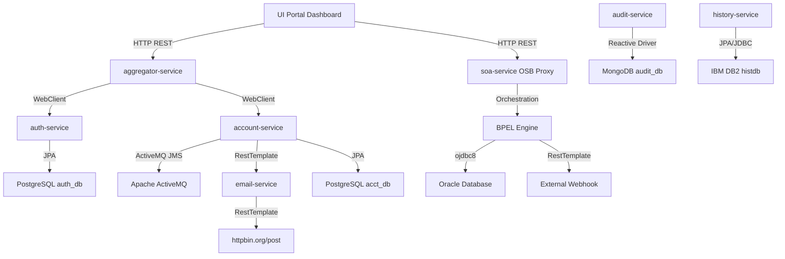

# RapidX Microservices Suite

A robust, enterprise-grade Java/Spring Boot microservices suite designed to manage user authentication, counterparty accounts registry, data synchronizations, history tracking, and compliance audit logging. It features multi-database integration (PostgreSQL, MongoDB, IBM DB2, Oracle Database), ActiveMQ messaging, an Oracle OSB/BPEL orchestration service, and a premium control center portal dashboard.

---

## 🏗️ Architecture & Component Overview

The suite consists of **seven Java microservices**, **five infrastructure datastores/message brokers**, and a **custom frontend control center**:



### 💻 Services & Frontend Portals

| Module / Service Name | Port | Stack / Primary Database | Purpose |
| :--- | :--- | :--- | :--- |
| **`dashboard-portal`** | `8880` | **Angular v21** standalone, ChartJS | Premium modern metrics dashboard and live microservice health monitor. |
| **`operations-portal`** | `9000` | **Angular v15** modules, RxJS, Forms | Operations hub handling User Auth, Account registry, OIM Sync, BPEL, Audit logs, and Reports compiling with File IO. |
| **`auth-service`** | `8081` | Spring Boot, PostgreSQL (`auth_db`) | Registers users, validates credentials, issues JWT tokens, and handles ROPC authorization. |
| **`account-service`** | `8080` | Spring Boot, PostgreSQL (`acct_db`) | Manages Counterparty Account records. Publishes JMS events to ActiveMQ when records change. |
| **`aggregator-service`** | `8082` | Spring Boot, H2 Gateway Database | Gatekeeper portal. Aggregates data from auth, account, and audit services for front-facing consumers. |
| **`soa-service`** | `8088` | **Java 8**, Spring Boot, Oracle DB | Emulates Oracle Service Bus (OSB) message proxy routing and Oracle SOA BPEL process orchestration. |
| **`email-service`** | `8083` | Spring Boot, External API REST | Simulates email notification sending and forwards payloads to external test webhook endpoints (`httpbin.org`). |
| **`audit-service`** | `8084` | Spring Boot, MongoDB (`audit_db`) | Captures reactive compliance audit logs. |
| **`history-service`** | `8085` | Spring Boot, IBM DB2 (`histdb`) | Logs system transition history in an enterprise DB2 warehouse. |
| **`report-service`** | `8086` | Spring Boot, Oracle Database | Compiles audit reports and handles server-side File IO (import/export CSV). |

### 🗄️ Infrastructure Datastores & Brokers

*   **PostgreSQL** (Port `5433` host / `5432` container): Stores user credentials (`auth_db`) and counterparties (`acct_db`).
*   **Oracle Database** (Port `1521`): Tracks BPEL orchestration process instances and analytics reports.
*   **MongoDB** (Port `27017`): NoSQL collection store for auditing events (`audit_db`).
*   **IBM DB2** (Port `50000`): Enterprise mainframe store tracking historical state records (`histdb`).
*   **Apache ActiveMQ** (Port `61616` TCP / `8161` console): Queue broker dispatching event telemetry between account-service and subscribers.

---

## 🔌 Core Microservice Inter-Communication & Flow

The system orchestrates operations across multiple components using three communication models:

### 1. Synchronous REST Gateway Flow (User Authentication & Counterparty Registry)
*   **Entrance**: Users hit the **`aggregator-service`** gateway.
*   **Validation**: The gateway communicates with **`auth-service`** via `WebClient` to validate JWT headers (`FMACJWT` or `FHLMCJWT`).
*   **Operation**: The query is routed to **`account-service`** using dynamic JPA Specifications to fetch filtered registries.

### 2. Event-Driven Messaging (ActiveMQ)
*   **Telemetry Dispatch**: When an account is registered or modified inside `account-service`, it invokes the JMS template:
    ```java
    jmsTemplate.convertAndSend("SF-BA0352-EBMQueue.local", accountEventPayload);
    ```
*   **Subscribers**: Downstream listeners consume from the queue to process data synchronization hooks.

### 3. Emulated Enterprise Integration Suite (OSB & BPEL Processes)
*   **OSB Proxy**: Custom entry endpoints (e.g. `POST /api/osb/proxy/process-account`) inside `soa-service` simulate **Oracle Service Bus**. The bus performs inbound validation and initiates pipeline transformations.
*   **BPEL Engine**: Handled by `BpelOrchestrationEngine.java` running on Java 8, performing a standard SOA orchestration sequence:
    1.  **Receive**: Read the inbound XML/JSON payload.
    2.  **Assign**: Bind request data fields to state variables.
    3.  **Invoke Database**: Store execution process instance records inside Oracle Database.
    4.  **Invoke Partner Gateway**: Call external gateways or webhooks (e.g. `httpbin.org/post`) using REST.
    5.  **Reply**: Cache the response log and reply to the OSB client.

### 4. File IO Data Processing (CSV Export & Import)
*   **Export**: When users trigger report export, `report-service` retrieves all reports from the Oracle Database, formats them as a CSV stream, writes it locally to the server folder `exported_reports/` using `java.io.FileWriter`, and streams it back to the client as a download.
*   **Import**: When users upload a CSV template, `report-service` caches the file in `uploaded_reports/` via `MultipartFile.transferTo`, parses the file using `java.io.BufferedReader` and `java.io.FileReader`, and saves all new entries to the database.

---

## 📮 API Endpoints Summary

### 1. Gateway Portal (`aggregator-service` - `8082`)
*   `POST /api/portal/register` — Register a new user (delegates to auth-service).
*   `POST /api/portal/login` — Log in a user and retrieve a JWT token (delegates to auth-service).
*   `GET /api/portal/accounts/filter` — Filter user/counterparty accounts using dynamic JPA (requires JWT).
*   `GET /api/portal/accounts/update-family/{id}` — Sync account updates downstream to account-service.

### 2. Oracle SOA Emulation (`soa-service` - `8088`)
*   `POST /api/osb/proxy/process-account` — Receives account payloads, transforms messages, and executes BPEL workflows.
*   `GET /api/bpel/instances` — Fetch process workflow tracking records from the Oracle DB.

### 3. Authentication (`auth-service` - `8081`)
*   `POST /api/auth/register` — Creates a new user credential account.
*   `POST /api/auth/login` — Authenticates credentials and returns a JWT token.
*   `GET /api/auth/users/filter` — Admin query route using dynamic filters.

### 4. Accounts Hub (`account-service` - `8080`)
*   `GET /accounts/filter` — Query accounts dynamically via JPA Specifications.
*   `POST /accounts/create` — Create a counterparty account (dispatches ActiveMQ message and email warning alert).

### 5. Auditing (`audit-service` - `8084`)
*   `POST /api/audit` — Log compliance audit events to MongoDB.
*   `GET /api/audit` — Fetch reactive audit streams.

### 6. Report Generation (`report-service` - `8086`)
*   `GET /api/reports` — Fetch all report records from Oracle DB.
*   `POST /api/reports` — Save new report record to Oracle DB.
*   `GET /api/reports/export` — Export database report records to a server-side CSV file and download it.
*   `POST /api/reports/import` — Upload and parse a CSV file to save report records to Oracle DB.

---

## 🚀 How to Run the Application

### Option A: Running via Docker Compose (Recommended)

This compiles and runs the databases, brokers, microservices, emulators, and the two frontend portals within a unified Docker network.

1.  **Navigate to the parent folder and start the entire application suite:**
    ```bash
    cd freddie_application
    docker compose up --build
    ```
    To run in detached background mode:
    ```bash
    docker compose up -d --build
    ```

2.  **Access the Frontend Portals:**
    *   **Enterprise Dashboard Portal (Angular 21):** Open **`http://localhost:8880`** in your browser.
    *   **Control Center Operations Portal (Angular 15):** Open **`http://localhost:9000`** in your browser.

3.  **Shut down the containers:**
    ```bash
    docker compose down
    ```

### Option B: Running Microservices Locally

For local debugging, you can spin up the datastores/brokers via Docker and then run the Spring Boot applications and frontend dev servers directly.

#### 1. Spin up Datastores & Brokers via Docker
Run this from the `freddie_application/` folder to launch only the infrastructure containers (PostgreSQL, MongoDB, DB2, Oracle DB, ActiveMQ):
```bash
cd freddie_application
docker compose up -d postgres activemq mongodb db2 oracle-db
```

#### 2. Run Backend Spring Boot Microservices
For each service, navigate to its folder in a new terminal window and run:

*   **`auth-service`** (Port `8081`):
    ```bash
    cd freddie_application/auth-service
    mvn spring-boot:run
    ```
*   **`account-service`** (Port `8080`):
    ```bash
    cd freddie_application/account-service
    mvn spring-boot:run
    ```
*   **`aggregator-service`** (Port `8082`):
    ```bash
    cd freddie_application/aggregator-service
    mvn spring-boot:run
    ```
*   **`email-service`** (Port `8083`):
    ```bash
    cd freddie_application/email-service
    mvn spring-boot:run
    ```
*   **`audit-service`** (Port `8084`):
    ```bash
    cd freddie_application/audit-service
    mvn spring-boot:run
    ```
*   **`history-service`** (Port `8085`):
    ```bash
    cd freddie_application/history-service
    mvn spring-boot:run
    ```
*   **`report-service`** (Port `8086`):
    ```bash
    cd freddie_application/report-service
    mvn spring-boot:run
    ```
*   **`legacy-service`** (Port `8087`):
    ```bash
    cd freddie_application/legacy-service
    mvn spring-boot:run
    ```
*   **`soa-service`** (Port `8088`):
    *Note: requires Java 8 configured as your active `JAVA_HOME`*
    ```bash
    cd freddie_application/soa-service
    mvn spring-boot:run
    ```

#### 3. Run Frontend Portals Locally
Make sure you have Node.js installed, then start the Angular development servers:

*   **`dashboard-portal`** (Angular v21):
    ```bash
    cd freddie_application/dashboard-portal
    npm install --legacy-peer-deps
    npm run start
    ```
    Now, navigate to: **`http://localhost:4200`** in your browser.

*   **`operations-portal`** (Angular v15):
    ```bash
    cd freddie_application/operations-portal
    npm install --legacy-peer-deps
    npm run start
    ```
    Now, navigate to: **`http://localhost:9000`** in your browser.

---

## 🧪 Step-by-Step Testing Walkthrough Using Angular UI

Once you have launched the backend docker containers and served the application, access the Operations Portal at `http://localhost:9000` and the Dashboard Portal at `http://localhost:8880`, then follow this checklist to test all application features end-to-end:

### 1. Test Authentication Gateway (`auth-service`)
1.  Navigate to the **Auth Gateway (auth)** tab in the sidebar.
2.  Review the default credentials (e.g., Client ID: `RapidX_Gateway_Client`).
3.  Click **Request Access Token**.
4.  **Verification**: 
    *   Confirm the green success message displays: *JWT Token successfully acquired and cached*.
    *   Inspect the **Decoded Payload** window; verify that the audience matches, the expiration time is set, and scopes/roles are correctly parsed.

### 2. Test Account Registrations & JMS Publishing (`account-service`)
1.  Navigate to the **Accounts Hub (account)** tab.
2.  In the "Register New Bank Account" card, input:
    *   **Account Name**: `Federal Escrow Reserve`
    *   **Counterparty**: `Wells Fargo`
3.  Click **Save Account**.
4.  **Verification**: Confirm the account is added to the "Account Service Registry" table on the right.
5.  In the "ActiveMQ Event Publisher" card, select `ACCOUNT_CREATED` as the event type and click **`jmsTemplate.convertAndSend()`**.
6.  **Verification**: Inspect the terminal console log output on the bottom. It should show a JSON telemetry event dispatch trace sent to destination queue `SF-BA0352-EBMQueue.local`.

### 3. Test OIM Data Synchronizations (`aggregator-service`)
1.  Navigate to the **OIM Sync Portal** tab.
2.  Input details for synchronization:
    *   **Account Name**: `Liquidity Clearing Cash`
    *   **Counterparty Name**: `Chase Bank`
3.  Click **Launch OIM Sync**.
4.  **Verification**:
    *   The "OIM Sync Response" console box will print the server connection logs and JSON response payload.
    *   Verify the "Aggregated Counterparty Registry" updates showing status `SYNCHRONIZED`.

### 4. Test Oracle OSB & BPEL Orchestration (`soa-service`)
1.  Navigate to the **BPEL Orchestration** tab.
2.  Input testing values:
    *   **Account ID**: `8088`
    *   **Account Name**: `BPEL Settlement Fund`
3.  Click **Invoke BPEL Process**.
4.  **Verification**:
    *   Watch the **Activity Sequence Monitor** highlight steps 1 to 6 sequentially as the OSB proxy accepts, validates, and forwards the message to the Java 8 BPEL engine.
    *   Ensure a new process instance record appears in the "Orchestration Process Instance Registry" with status `COMPLETED` and the input payload stored.

### 5. Test Audit Compliance Logs (`audit-service`)
1.  Navigate to the **Audit Logs** tab.
2.  Input a query (e.g. `OIM`) into the search bar, or choose `aggregator-service` in the dropdown filter.
3.  **Verification**: Confirm the log grid updates reactively to show matching audit logs persisted in MongoDB.

### 6. Test Report Generation & File IO (`report-service`)
1.  Navigate to the **Reports Center (report)** tab.
2.  Input report fields:
    *   **Report Title**: `Q2 Reconciliations`
    *   **Summary**: `All accounts sync tasks verified and registered.`
3.  Click **Compile Report**.
4.  **Verification**:
    *   Confirm the database success message flashes.
    *   Verify the report registry table updates with the new entry.
    *   Check the "Database Connection" card to verify database parameters.
5.  Test **File Export**:
    *   Under the **File IO Operations** card, click **Export to CSV**.
    *   **Verification**: A CSV download is triggered (e.g., `reports_export.csv` or `mock_reports_export.csv`).
    *   Check the server directory `exported_reports/` to verify that the CSV file was saved to the server storage.
6.  Test **File Import**:
    *   Select a valid CSV file (containing `Title,Content Findings,Generated At` headers) using the file input.
    *   Click **Upload & Import**.
    *   **Verification**: The new reports are parsed (either server-side if online, or client-side if offline) and loaded into the reports table.
    *   Check the server directory `uploaded_reports/` to verify that the imported CSV file was cached on the server storage.
